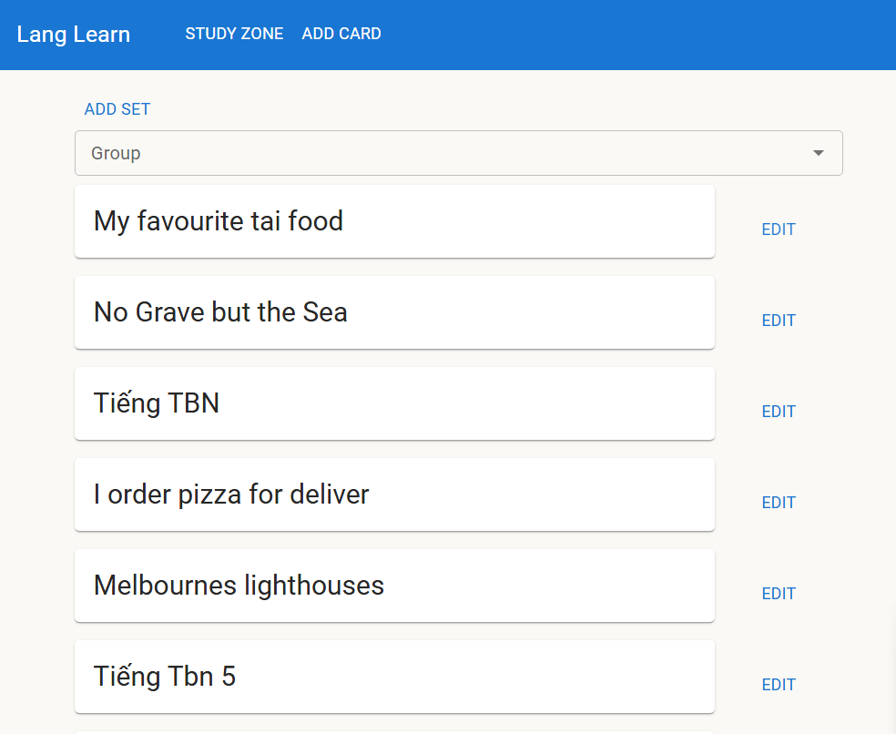
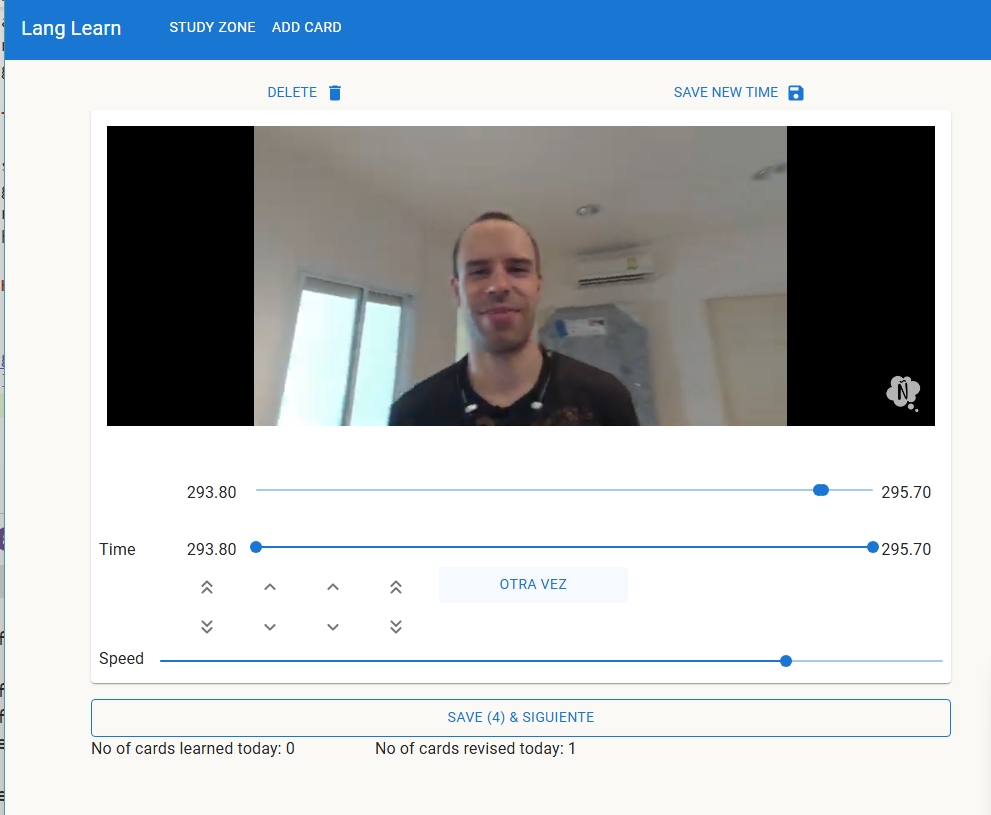

## Introduction

This is a web app I made for myself to learn Spanish pronunciation through Youtube videos. The main idea is that you create and save short clips (a few seconds each) from a Youtube video of a person speaking, then over a few days try and imitate the same clips (this is also known as the shadowing technique). Anyone can use this to learn to speak a dialect, a language of their choosing or learn to sing a song.

## Tools

This is a fullstack web app built with Next.JS (Node and React) and MongoDB Database. For deployment, it's deployed to a container in Azure Container Services, via a container image hosted on the Github Container Registry.

## Have a look

The production site can be found at [lang-learn.mquang.dev](http://lang-learn.mquang.dev/). You'll need to put in your email address and log in via a one-time link sent to your inbox.

## Some photos

